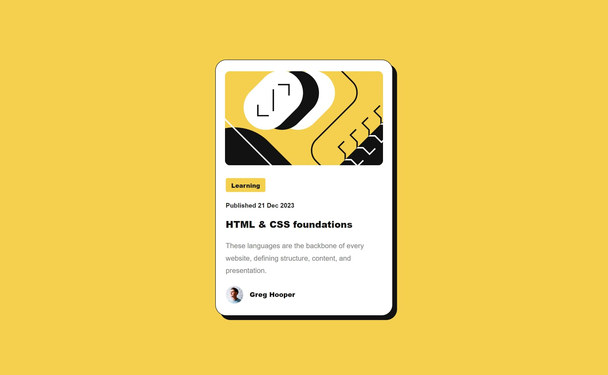
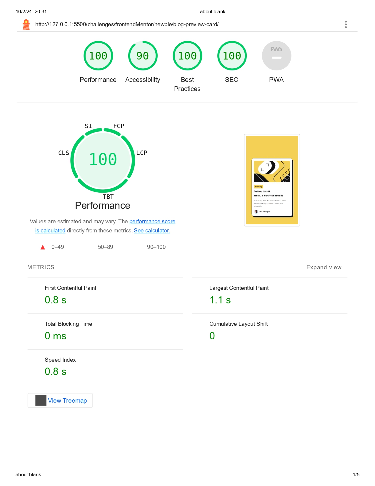

# Frontend Mentor - Blog preview card solution

This is a solution to the [Blog preview card challenge on Frontend Mentor](https://www.frontendmentor.io/challenges/blog-preview-card-ckPaj01IcS).

## Table of contents

- [Frontend Mentor - Blog preview card solution](#frontend-mentor---blog-preview-card-solution)
  - [Table of contents](#table-of-contents)
  - [Overview](#overview)
    - [My solution screenshot](#my-solution-screenshot)
    - [Design Handoff](#design-handoff)
      - [Desktop](#desktop)
      - [Mobile](#mobile)
    - [Challenge style Guide](#challenge-style-guide)
      - [Layout](#layout)
      - [Colors](#colors)
        - [Primary](#primary)
        - [Neutral](#neutral)
      - [Typography](#typography)
        - [Body Copy](#body-copy)
      - [Font](#font)
  - [My process](#my-process)
    - [Built with](#built-with)
    - [Lighthouse Test](#lighthouse-test)
      - [Observations](#observations)

## Overview

### My solution screenshot

### Design Handoff

#### Desktop

#### Mobile

### Challenge style Guide

#### Layout

The designs were created to the following widths:

- Mobile: 375px
- Desktop: 1440px

#### Colors

##### Primary

- Yellow: hsl(47, 88%, 63%)

##### Neutral

- White: hsl(0, 0%, 100%)
- Grey: hsl(0, 0%, 50%)
- Black: hsl(0, 0%, 7%)

#### Typography

##### Body Copy

- Font size (paragraph): 16px

#### Font

- Family: [Figtree](https://fonts.google.com/specimen/Figtree)
- Weights: 600, 800

## My process

### Built with

- Semantic HTML5 markup
- CSS custom properties
- Flexbox
- Mobile-first workflow

### Lighthouse Test

#### Observations
- The paragraph's color style provided by the challenge do not offer optimal contrast ratio for a good accessible experience.