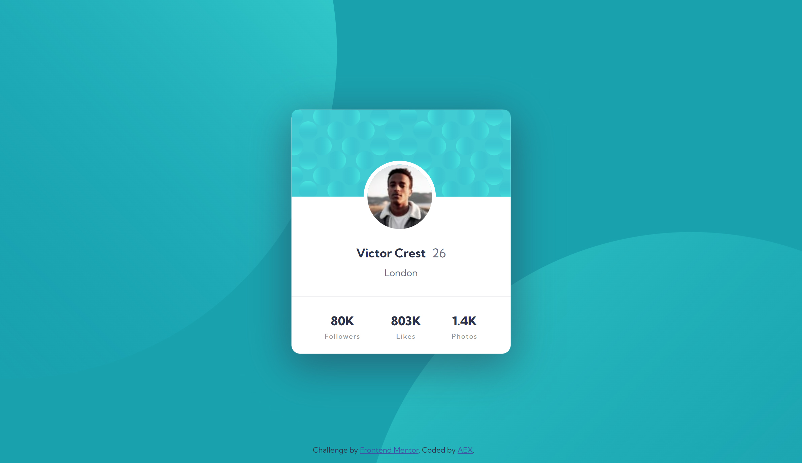
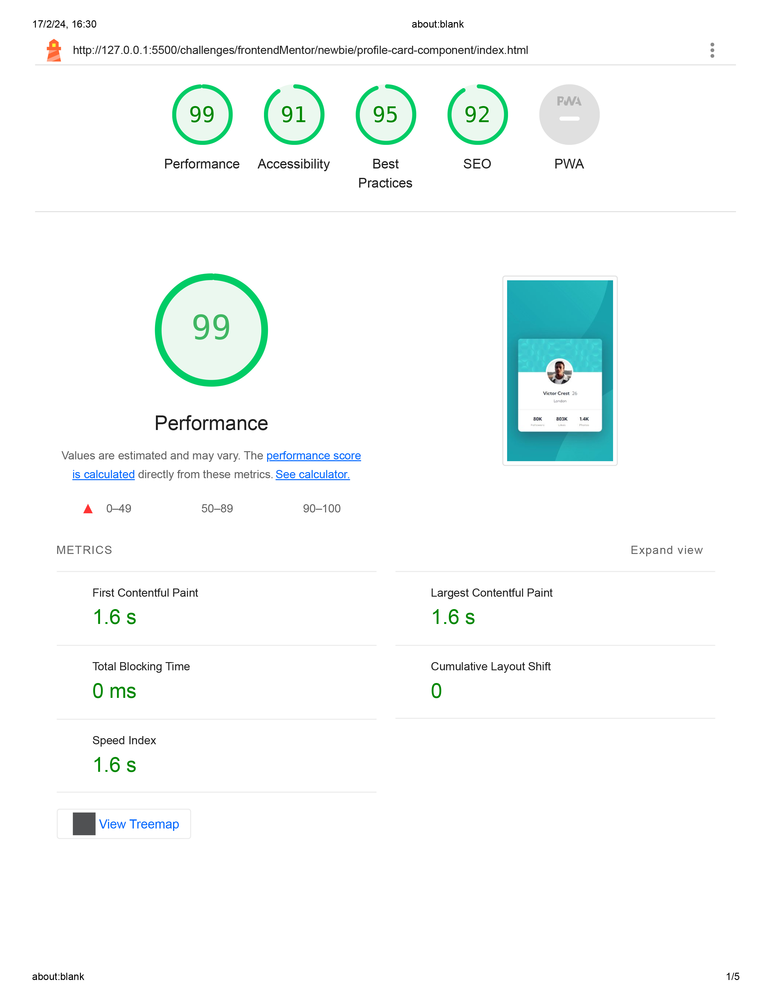

# Frontend Mentor - Profile card component solution

This is a solution to the [Profile card component challenge on Frontend Mentor](https://www.frontendmentor.io/challenges/profile-card-component-cfArpWshJ). 

## Table of contents

- [Frontend Mentor - Profile card component solution](#frontend-mentor---profile-card-component-solution)
  - [Table of contents](#table-of-contents)
  - [Overview](#overview)
    - [My solution screenshot](#my-solution-screenshot)
    - [Design Handoff](#design-handoff)
      - [Desktop](#desktop)
      - [Mobile](#mobile)
    - [Challenge style Guide](#challenge-style-guide)
      - [Layout](#layout)
      - [Colors](#colors)
        - [Primary](#primary)
        - [Neutral](#neutral)
      - [Typography](#typography)
        - [Body Copy](#body-copy)
        - [Font](#font)
  - [My process](#my-process)
    - [Built with](#built-with)
    - [Lighthouse Test](#lighthouse-test)

---

## Overview

### My solution screenshot

### Design Handoff

#### Desktop

#### Mobile

### Challenge style Guide

#### Layout

The designs were created to the following widths:

- Mobile: 375px
- Desktop: 1440px

#### Colors

##### Primary

Dark cyan: hsl(185, 75%, 39%)
Very dark desaturated blue: hsl(229, 23%, 23%)
Dark grayish blue: hsl(227, 10%, 46%)

##### Neutral

Dark gray: hsl(0, 0%, 59%)

#### Typography

##### Body Copy

- Font size (name and stats): 18px

##### Font

- Family: [Kumbh Sans](https://fonts.google.com/specimen/Kumbh+Sans)
- Weights: 400, 700

---

## My process

### Built with

- Semantic HTML5 markup
- CSS custom properties
- Flexbox
- Mobile-first workflow

### Lighthouse Test

