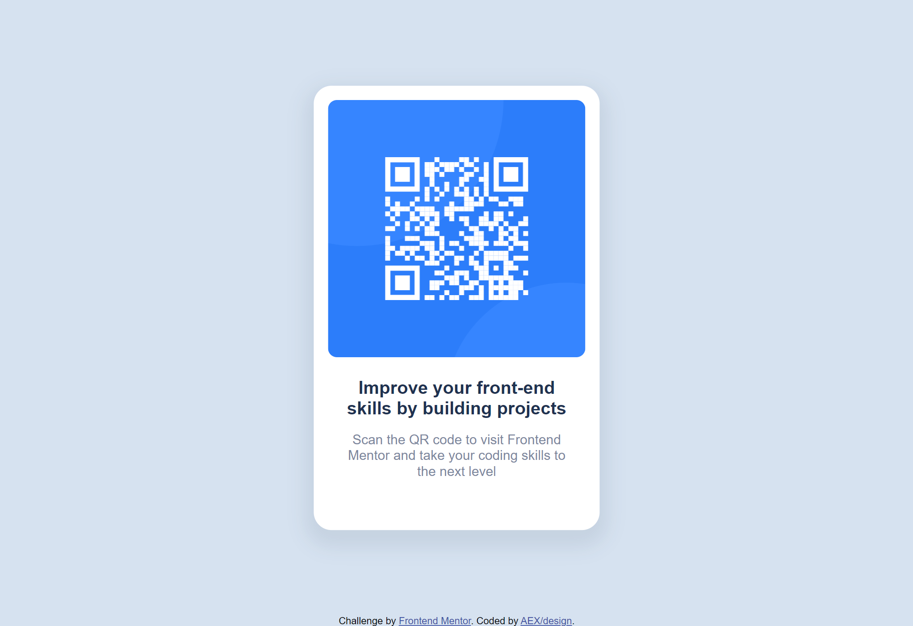
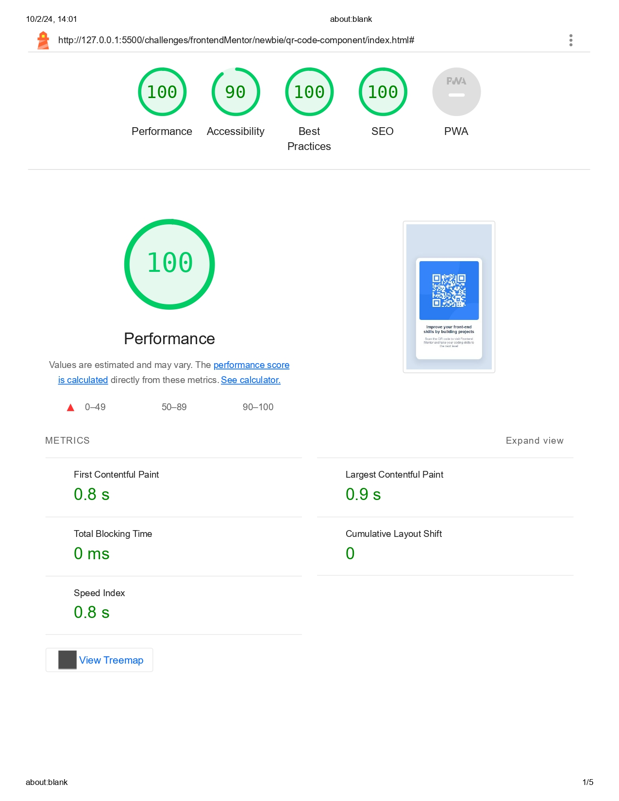

# Frontend Mentor - QR code component solution

My solution to the [QR code component challenge on Frontend Mentor](https://www.frontendmentor.io/challenges/qr-code-component-iux_sIO_H).

## Table of contents

- [Frontend Mentor - QR code component solution](#frontend-mentor---qr-code-component-solution)
  - [Table of contents](#table-of-contents)
  - [Overview](#overview)
    - [Screenshot](#screenshot)
    - [Design Handoff](#design-handoff)
      - [Desktop](#desktop)
      - [Mobile](#mobile)
    - [Challenge style Guide](#challenge-style-guide)
      - [Layout](#layout)
      - [Colors](#colors)
      - [Typography](#typography)
      - [Body Copy](#body-copy)
      - [Font](#font)
  - [My process](#my-process)
    - [Built with](#built-with)
    - [Test](#test)

## Overview

### Screenshot

### Design Handoff

#### Desktop

#### Mobile

### Challenge style Guide

#### Layout

The designs were created to the following widths:

- Mobile: 375px
- Desktop: 1440px

#### Colors

- White: hsl(0, 0%, 100%)
- Light gray: hsl(212, 45%, 89%)
- Grayish blue: hsl(220, 15%, 55%)
- Dark blue: hsl(218, 44%, 22%)

#### Typography

#### Body Copy

- Font size (paragraph): 15px

#### Font

- Family: [Outfit](https://fonts.google.com/specimen/Outfit)
- Weights: 400, 700

## My process

### Built with

- Semantic HTML5 markup
- CSS custom properties
- Flexbox
- Mobile-first workflow

### Test
Tested with Google Chrome Lighthouse:

